<p align="center">
  
</p>

<h1 align="center">qBitGlass</h1>

<p align="center">
  用 SwiftUI 打造、採用 iOS 26 <b>Liquid Glass</b> 玻璃設計的 qBittorrent 遠端管理 App<br>
  <sub>A native iOS remote for qBittorrent WebUI, built with SwiftUI and Liquid Glass.</sub>
</p>

<p align="center">
  
  
  
  
  <a href="LICENSE"></a>
</p>

<p align="center">
  <a href="../../releases/latest"><b>⬇️ 下載 IPA</b></a> ·
  <a href="#安裝">安裝</a> ·
  <a href="#快速開始">快速開始</a> ·
  <a href="#自行建置">自行建置</a>
</p>

---

## 截圖

| 種子清單 | 全選與批次操作 | 刪除確認 | 篩選與排序 |
| :---: | :---: | :---: | :---: |
| 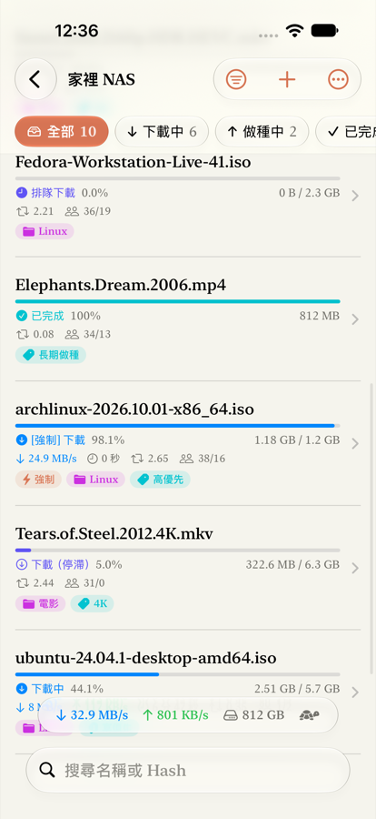 | 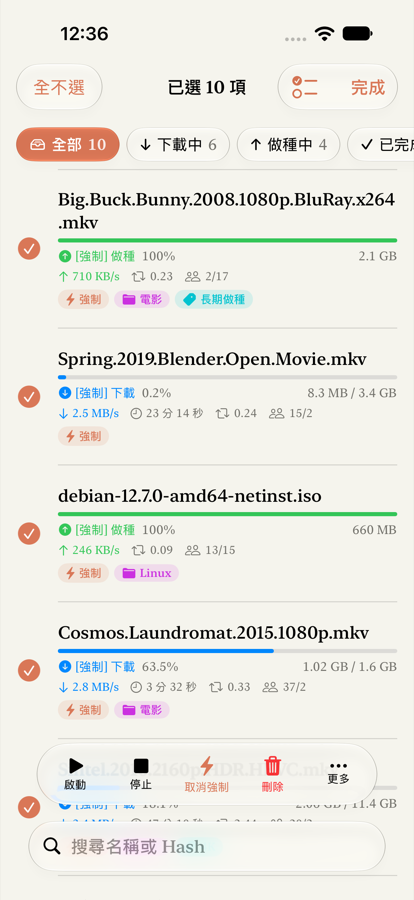 | 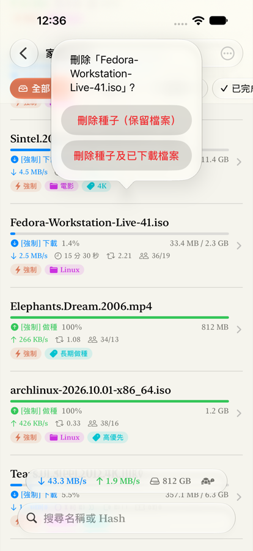 | 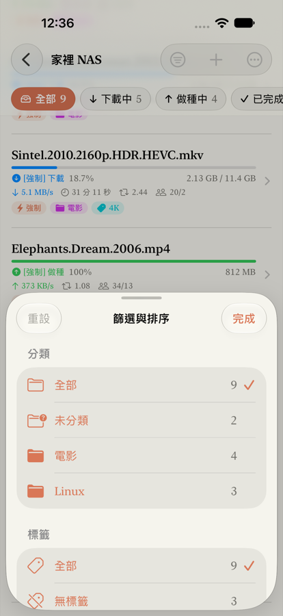 |
| **種子詳情** | **檔案優先順序** | **Tracker 狀態** | **新增種子** |
| 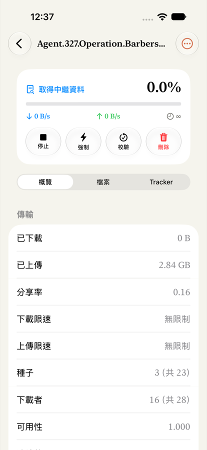 | 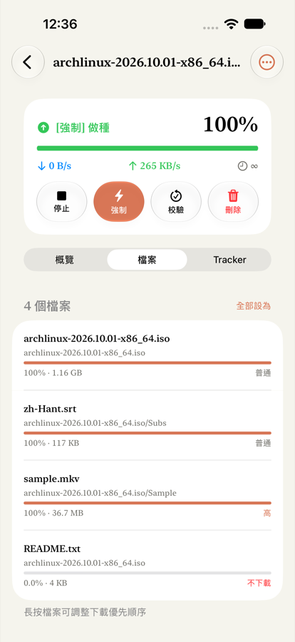 | 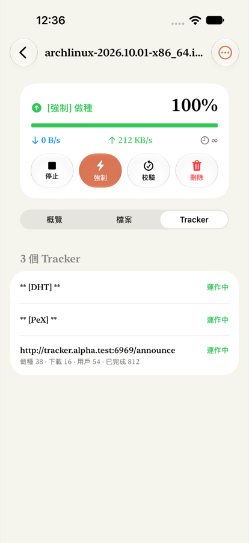 | 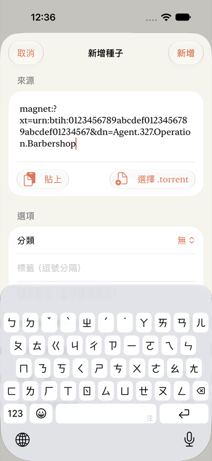 |
| **伺服器清單** | **伺服器設定** | **深色模式** | **深色模式詳情** |
| 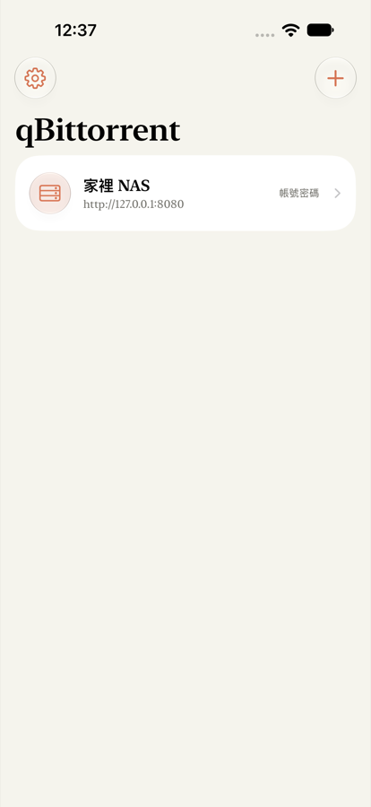 | 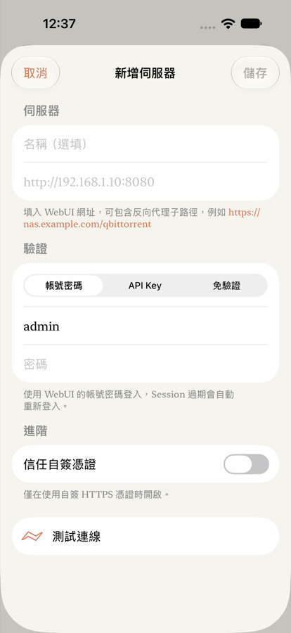 | 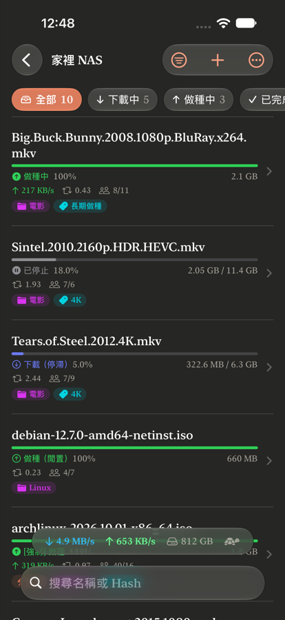 | 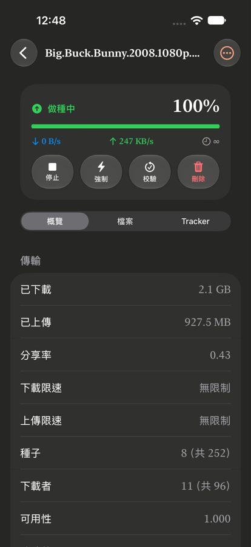 |

## 功能

**篩選與搜尋**
- 頂部狀態膠囊一鍵切換：全部、下載中、做種中、已完成、已停止、活動中、停滯、檢查中、錯誤
- 篩選面板可依**分類**、**標籤**、**Tracker** 篩選，每個選項都會顯示數量
- 可搜尋名稱或 Hash，多個關鍵字以空白分隔
- 排序依據有加入時間、名稱、大小、進度、速度、剩餘時間、分享率等 16 種，可切換遞增或遞減

**批次操作**
- **全選／反選／全不選**，也可一鍵選取已停止、已完成或錯誤的種子
- 底部玻璃操作列：**啟動**、**停止**、**強制啟動／取消強制**、**刪除**（可選擇保留或刪除檔案）
- 更多操作：重新校驗（會先確認）、重新匯報、設定分類、管理標籤、佇列優先順序、依序下載、首尾區塊優先、複製磁力連結
- 左滑刪除或啟動／停止，右滑強制啟動，長按開啟完整操作選單
- 刪除與重新校驗的確認框會從點擊的那一列或按鈕彈出，批次刪除完成後自動離開選取模式

**種子詳情**
- 概覽：傳輸量、分享率、限速、種子與下載者數、區塊、時間、路徑、Hash
- 檔案：下載進度，點選檔案即可設定優先順序（不下載、普通、高、最高）
- Tracker：連線狀態、做種、下載與完成數、錯誤訊息
- 重新命名、變更儲存位置

**新增種子**
- 支援磁力連結或網址（一行一個）、選取多個 `.torrent` 檔
- 可設定分類、標籤、儲存路徑、加入後不開始、跳過雜湊檢查、依序下載、先下載首尾區塊
- 在 Safari 點 `magnet:` 連結，或在「檔案」App 開啟 `.torrent` 檔，都能直接交給 qBitGlass

**連線**
- 多伺服器管理，可設定網址子路徑以支援反向代理
- 登入方式有三種：**帳號密碼**（Session 過期自動重新登入）、**API Key**（qBittorrent 5.2+）、**免驗證**
- 可信任自簽 HTTPS 憑證
- 可設定經由代理連線（HTTP 或 SOCKS5），區網與 Tailscale 位址也一律走代理；開啟時自動帶入系統目前的代理
- 連線失敗時可直接在畫面上編輯伺服器，儲存後立即以新設定重新連線
- 依 WebAPI 版本自動相容 qBittorrent 4.x（`pause`／`resume`）與 5.x（`stop`／`start`）
- 透過 `sync/maindata` 增量同步，只在 App 位於前景時輪詢，刷新間隔可在 1–10 秒間調整
- 密碼與 API Key 存放在 Keychain

**設計**
- iOS 26+ 使用 Liquid Glass，包括 `glassEffect`、`GlassEffectContainer`、`.buttonStyle(.glass)` 和 `safeAreaBar`；iOS 17–25 自動退回毛玻璃材質
- iOS 26+ 篩選、新增種子、新增伺服器等畫面會從觸發的工具列按鈕展開
- 參考 Claude 的視覺風格：使用 New York 襯線字體，配色為 Claude 橘 `#D97757` 搭配象牙白，並支援深色模式

## 安裝

到 [Releases](../../releases/latest) 下載 `qBitGlass.ipa`。這是**未簽名**的 IPA，請擇一方式安裝：

| 方式 | 說明 |
| --- | --- |
| **Sideloadly**（推薦） | 電腦用 USB 接上 iPhone，拖入 IPA 並登入 Apple ID。免費帳號每 7 天需重新簽名 |
| **AltStore / SideStore** | 手機端安裝，可自動續簽 |
| **TrollStore** | 若裝置支援，可永久安裝 |
| **Xcode** | 自行建置，在 Signing 選擇你的 Apple ID Team 後直接 Run |

> iOS 16 以上需在「設定 → 隱私權與安全性」開啟**開發者模式**。第一次連線時請允許「區域網路」權限。

## 快速開始

1. 在 qBittorrent 開啟 **偏好設定 → Web UI → Web 使用者介面（遠端控制）**，設定連接埠、帳號和密碼
2. 在 qBitGlass 點右上角 **＋** 新增伺服器，網址填 `http://電腦IP:8080`
3. 點「測試連線」，確認成功後儲存

### 連線問題排解

| 錯誤訊息 | 原因與處理 |
| --- | --- |
| 登入失敗：帳號或密碼錯誤 | 帳密確實不符。v1.0.1 以前的版本連 qBittorrent 5.2+ 會誤報這個訊息，請更新到 v1.0.2 以上 |
| qBittorrent 拒絕了這個連線位址（401） | 被「主機標頭驗證」擋下，常見於 Docker 或路由器把外部連接埠對應到不同的內部連接埠。請在 Web UI 設定關閉「啟用主機標頭驗證」，或讓內外連接埠相同 |
| 伺服器要求轉址到… | 反向代理把網址轉到別處（例如 http → https），在編輯伺服器畫面點「改用…」即可 |
| 此 IP 因多次登入失敗已被封鎖 | qBittorrent 的登入失敗封鎖，等封鎖時間過後再試，或在 Web UI 設定調整 |

## 自行建置

需要 Xcode 26 以上版本與 [XcodeGen](https://github.com/yonaskolb/XcodeGen)：

```bash
brew install xcodegen
xcodegen generate          # 由 project.yml 產生 QBManager.xcodeproj
scripts/build_ipa.sh       # 輸出 dist/qBitGlass.ipa（未簽名）
```

## 測試

`scripts/mock_qb.py` 是依 qBittorrent WebUI API 行為撰寫的模擬伺服器，只監聽 `127.0.0.1`，不需要安裝 qBittorrent 就能開發與測試。預設模擬 5.2 的回應（登入成功回 204、帳密錯誤回 401，並檢查主機標頭連接埠），設 `MOCK_LEGACY=1` 則模擬 5.1 以前的「Ok.」／「Fails.」：

```bash
# 帳號 admin / adminadmin，API Key：qbt_testkey；UI 測試需要讓 addTags 失敗來檢查錯誤提示
MOCK_FAIL=torrents/addTags python3 -I scripts/mock_qb.py 8080 &
python3 -I scripts/test_proxy.py 18888 &   # 測試「經由代理連線」用的本機代理（HTTP CONNECT 與 SOCKS5）
xcodebuild -project QBManager.xcodeproj -scheme QBManager \
  -destination 'platform=iOS Simulator,name=iPhone 18 Pro' test
```

UI 測試會跑完以下流程，並把截圖存到 `build/shots/`：

- 載入 → 狀態篩選 → 全選 → 批次強制啟動 → 左滑刪除 → 分類篩選 → 詳情／檔案／Tracker → 新增磁力連結
- 確認框是否從觸發的列或按鈕彈出（比對 popover 與來源元件的位置）、sheet 內的錯誤提示、點選檔案調整優先順序
- 從表單新增伺服器，分別以錯誤與正確的密碼測試連線，儲存後直接進入；從「更多」和連線失敗畫面編輯伺服器後重新連線

## 專案結構

```
QBManager/
├── App/        App 入口、RootView
├── API/        QBClient（WebUI API 客戶端）、SyncEngine（maindata 增量同步）、Multipart
├── Models/     Torrent、篩選與排序、伺服器設定、JSONValue
├── Store/      AppModel（伺服器清單）、SessionStore（連線、輪詢、批次操作）
├── Support/    Theme（Liquid Glass／字體／配色）、Formatters、Keychain
└── Views/      清單、詳情、篩選、新增、分類與標籤、伺服器設定
QBManagerUITests/   UI 自動化測試
scripts/            build_ipa.sh、mock_qb.py、make_icon.swift
```

## 參考資料

- [qBittorrent WebUI API (5.0)](https://github.com/qbittorrent/qBittorrent/wiki/WebUI-API-(qBittorrent-5.0))
- [API Key Authentication (≥ v5.2.0)](https://git.blizzard.systems/github-mirrors/qbittorrent/wiki/API-Key-Authentication-(%E2%89%A5v5.2.0))
- [qbittorrent-api CHANGELOG](https://github.com/rmartin16/qbittorrent-api/blob/main/CHANGELOG.md)（各版本 WebAPI 差異）
- [Apple — Applying Liquid Glass to custom views](https://developer.apple.com/documentation/swiftui/applying-liquid-glass-to-custom-views)

## 授權

[MIT](LICENSE)。本專案與 qBittorrent 官方或 Anthropic 無關；「Claude 風格」僅指視覺上的參考，未使用任何官方字體或資產。
